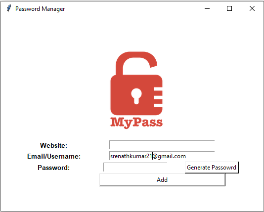
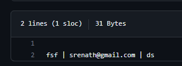

<!DOCTYPE html>
<html>
  <head>
    <meta charset="UTF-8">
  </head>
  <body>
    <h1>Python Password Generator</h1>
    
This is a random password generator that also stores the secret password to a file. It also helps to get the username and password when you add a website in the input. This was made with Tkinter in Python for GUI design interface.

    <h2>Features</h2>
    <ul>
      <li>Generates random passwords</li>
      <li>Stores password to a file</li>
      <li>Adds website, username, and password to input</li>
      <li>Clears input fields</li>
    </ul>
    <h2>Technology Stack</h2>
    <ul>
      <li>Python</li>
      <li>Tkinter</li>
    </ul>
    <h2>Output Examples</h2>
    <h3>Generator Interface</h3>
    
    <h3>Password File</h3>
    
  </body>
</html>
